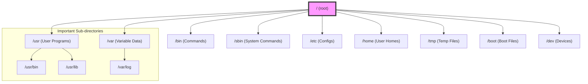

# 1. The Filesystem Hierarchy Standard (FHS): The Blueprint of Linux 🗺️

Mawa, manam `01-Getting-Started` lo `cd` command tho directories lo ki vellam. Kani, asalu ee directories (`/bin`, `/etc`, `/home`, `/var`) enduku ala peru pettaru? Andaroo ade structure enduku follow avtaru?

The answer is the **Filesystem Hierarchy Standard (FHS)**.

## What is the FHS?

FHS anedi oka blueprint, oka set of rules anamata. Idi prathi Linux and Unix-like operating system lo files and directories ni ela organize cheyalo define chestundi. Ee standard valla, nuvvu aey Linux distro (Ubuntu, CentOS, Fedora) use chesina, directory structure almost same ga untundi.

Here is a visual overview of the main directories:

**Why is this important?**
Imagine chesko, prathi city lo roads, hospitals, and police stations ni oka standard plan prakaram kakunda, istam vachinattu kattaru anuko. Oka city nunchi inkoka city ki velthe, antha confusion.

FHS kuda alanti confusion ni prevent chestundi.
*   **For Software Developers:** Vallu రాసే software, configuration files kosam `/etc` lo, log files kosam `/var/log` lo chustundi ani fix avvochu.
*   **For System Administrators (like us!):** Manam aey server meeda work chesina, essential commands `/bin` lo untayani, user data `/home` lo untundani telusu. This predictability makes our job much easier.
*   **For the System Itself:** The OS knows where to find critical files needed for booting (`/boot`) and running the system.

In short, FHS brings order to the chaos. It provides a consistent and predictable structure that everyone can rely on.

In the next file, we will explore the most important directories defined by the FHS one by one. Get ready to understand the map of your Linux system! 🚀
