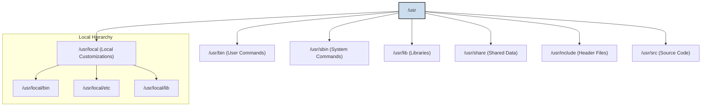

# 2. A Tour of the Root (`/`) Filesystem 🚌

Mawa, manam FHS gurinchi nerchukunnam. Ippudu manam Linux system lo unna main directories, yani "root filesystem" (`/`) lo unna prathi folder gurinchi detail ga telusukundam. Think of this as a guided tour of your Linux city.

Here is a more detailed map of the root filesystem, with related directories grouped together:

```mermaid
graph TD
    subgraph "Root Filesystem (`/`)"
        direction LR
        A["/"]
    end

    subgraph "Essential Binaries"
        B["/bin"]
        C["/sbin"]
    end

    subgraph "System & User Data"
        D["/etc (Configs)"]
        E["/home"]
        F["/root (Admin Home)"]
        G["/var (Variable Data)"]
    end

    subgraph "Software & Libraries"
        H["/usr (User Resources)"]
        I["/opt (Optional Software)"]
        J["/lib (Libraries)"]
    end

    subgraph "System Internals"
        K["/boot (Bootloader)"]
        L["/dev (Devices)"]
        M["/proc (Processes)"]
        N["/sys (System)"]
    end

    subgraph "Temporary & Mounts"
        O["/tmp"]
        P["/mnt"]
        Q["/media"]
    end

    A --> B & C & D & E & F & G & H & I & J & K & L & M & N & O & P & Q

    style A fill:#f9f,stroke:#333,stroke-width:4px
```

Ee directories anni `ls -l /` command tho chudochu.

---

### **`/` (The Root Directory)**
*   **Purpose:** Ide anthaటికీ மூலம். The top-level directory of the entire filesystem. Anni files and directories ee `/` lopalane untayi. Windows lo `C:\` drive laantidi, but even more fundamental.

### **`/bin` (Essential User Binaries)**
*   **Purpose:** System lo unna andaru users ki avasaram ayye most essential commands (binaries) ikkada untayi. For example, `ls`, `cp`, `mv`, `cat`, `echo` lanti commands ikkade untayi. Ee commands system boot avvadaniki and repair cheyadaniki kuda avasaram.

### **`/sbin` (System Binaries)**
*   **Purpose:** `s` ante "system" or "superuser". Ee directory lo system administration ki matrame use chese powerful commands untayi. Normal users veetini run cheyaleru. Examples: `fdisk`, `ifconfig`, `reboot`, `mkfs`.

### **`/etc` (Etcetera / Configuration Files)**
*   **Purpose:** System-wide configuration files anni ikkade untayi. Ee directory lo unna files anni plain text files, so manam vaatini edit chesi software behavior ni change cheyochu. For example, `sshd_config` (for SSH server), `fstab` (for filesystems), `passwd` (for user info).

### **`/home` (User Home Directories)**
*   **Purpose:** Prathi normal user ki oka separate home directory ikkada create avtundi. For example, `jules` ane user ki `/home/jules` ane directory untundi. Users తమ personal files, documents, and user-specific configuration files (`.bashrc`, `.profile`) ni ikkade store cheskuntaru.

### **`/root` (Root User's Home)**
*   **Purpose:** Idi `/home` lanti de, kani idi **root** user (the superuser/administrator) యొక్క personal home directory. Normal users home directories `/home` lo unte, root user home directory separate ga untundi.

### **`/var` (Variable Files)**
*   **Purpose:** `var` ante "variable". Ee directory lo eppudu change avutune files untayi. The most important things here are log files (`/var/log`), mail spools, and temporary files used by applications.

### **`/tmp` (Temporary Files)**
*   **Purpose:** System and users create chese temporary files kosam ee directory. Ikkada unna files system reboot ayinappudu automatically delete aipotayi. Never store important data here!

### **`/usr` (Unix System Resources)**
*   **Purpose:** Idi system lo pedda directories lo okati. Deenini "user" ani anukuntaru, kani its actual meaning is "Unix System Resources". Ee directory lo user-install chesina software, libraries, and documentation untayi. It has its own hierarchy like `/usr/bin`, `/usr/sbin`, `/usr/lib`.

Here is a look inside the `/usr` directory's own hierarchy:

### **`/opt` (Optional Software)**
*   **Purpose:** Third-party software ni install cheyadaniki ee directory use chestaru. For example, Google Chrome or Slack lanti software తమ files ni `/opt/google/chrome` lanti path lo install cheskuntayi.

### **`/dev` (Device Files)**
*   **Purpose:** Linux lo prathi hardware device (hard disk, keyboard, mouse, USB drive) ni oka file la represent chestaru. Aa device files anni ee `/dev` directory lo untayi. For example, `/dev/sda` might be your first hard disk.

### **`/proc` (Process Information)**
*   **Purpose:** Idi oka virtual filesystem. Ante, ikkada unna files actual ga disk meeda undavu. The kernel creates them on-the-fly to provide information about running processes. Prathi running process ki, daani PID tho oka directory untundi (e.g., `/proc/1234`).

### **`/sys` (System Information)**
*   **Purpose:** Idi kuda `/proc` lanti oka virtual filesystem. Kani idi system hardware and kernel modules gurinchi information istundi.

### **`/lib` (Essential Shared Libraries)**
*   **Purpose:** `/bin` and `/sbin` lo unna essential commands ki కావలసిన library files ikkada untayi. Ee libraries system boot avvadaniki chala crucial.

### **`/boot` (Boot Loader Files)**
*   **Purpose:** System boot avvadaniki కావలసిన files anni ikkada untayi. The Linux kernel itself (`vmlinuz`) and the bootloader configuration (GRUB) are stored here. Ee directory ni chala jagrathaga handle cheyali.

### **`/mnt` (Mount Point)**
*   **Purpose:** `mnt` ante "mount". Temporary ga filesystems ni mount cheyadaniki (like a network share) ee directory ni use chestaru.

### **`/media` (Removable Media)**
*   **Purpose:** USB drives, CD-ROMs lanti removable media ni system automatically detect chesi, ee directory lo mount chestundi.

---
Mawa, ippudu neeku Linux filesystem యొక్క basic map ardam ayyindi anukuntunna. Next, manam absolute and relative paths gurinchi nerchukundam to navigate this map effectively.
