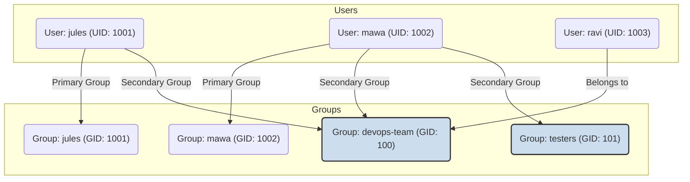

# 1. User and Group Concepts: The Foundation of Linux Security 👥

Mawa, Linux anedi oka multi-user operating system. Ante, okate system ni chala mandi users okesari use cheyochu. Anduke, prathi user ki separate ga permissions and security manage cheyadam chala important. Ee module lo, manam aa user management gurinchi nerchukundam.

Ee concepts ardam cheskunte, security and collaboration ni manam effective ga handle cheyagalam.

---

## What is a User?

Linux lo, prathi person or service that interacts with the system is represented by a **user account**. Prathi user account ki oka unique name (username) and a unique number (**UID** - User ID) untundi.

*   **Normal User:** Standard user accounts for humans to log in and perform tasks. They have limited permissions and can only modify files in their own home directory (`/home/username`).
*   **System User:** Special accounts created for running specific services or applications (e.g., `www-data` for a web server, `mysql` for a database). Ee users normal ga login cheyaru; valla purpose aa service ni secure ga run cheyadame.

## What is a Group?

A **group** is a collection of users. Groups make it easy to manage permissions for multiple users at once. Prathi group ki kuda oka unique name and a unique number (**GID** - Group ID) untundi.

*   **Primary Group:** User create chesinappudu, default ga user peru tho ne oka group create avtundi. Adi aa user yokka primary group.
*   **Secondary Groups:** Oka user ni vere groups lo kuda add cheyochu. For example, `devops-team` ane group lo unna andaru users ki oka specific file ni access cheyadaniki permission ivvochu.

Here is a diagram to visualize this relationship:

## The Superuser: `root`

Linux lo, `root` anedi oka special user. Ee user ki system meeda complete and unrestricted power untundi. `root` user aey file naina chudochu, edit cheyochu, delete cheyochu, and aey command naina run cheyochu. The UID for the `root` user is always **0**.

Because it's so powerful, it's considered a very bad practice to log in and work as `root` for daily tasks. Instead, normal users are given temporary root privileges using the `sudo` command when needed.

---

## Core Configuration Files

User and group information antha konni important text files lo store avtundi.

### **`/etc/passwd`**
*   **Purpose:** Contains essential information about user accounts. Ee file world-readable, ante andaru chudochu.
*   **Format (per line):** `username:x:UID:GID:comment:home_directory:login_shell`
    *   `x`: Password anedi ee file lo undadu, adi `/etc/shadow` lo untundi.

### **`/etc/shadow`**
*   **Purpose:** Contains the encrypted (hashed) passwords for user accounts. Ee file chala secure; ਕੇవలం `root` user matrame deenini chudagaladu.
*   **It also contains password policy information**, like expiration date, etc.

### **`/etc/group`**
*   **Purpose:** Defines all the groups on the system and lists their members.
*   **Format (per line):** `group_name:x:GID:list_of_members`

### **`/etc/gshadow`**
*   **Purpose:** Secure information about groups, like a group password (which is rarely used).

Mawa, ee foundational concepts meeda ne manam next files lo build avutam. Ippudu neeku user, group, and root ante ento telusu. Next, manam ee users ni create cheyadaniki and manage cheyadaniki vaade commands ni chuddam.
