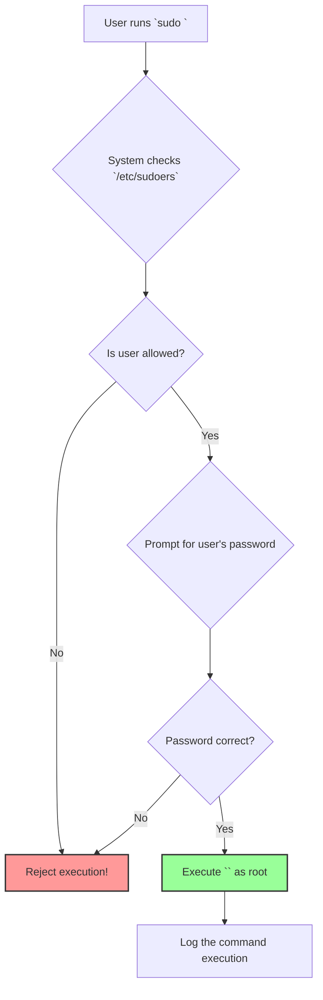

# 4. `sudo` Configuration: Granting Superuser Powers Safely 🦸

Mawa, manam `root` user entha powerful o chusam. Kani, rojuvari panulaki `root` account tho login avvadam anedi chala dangerous. Oka chinna typo tho system antha crash cheyochu. So, what's the solution?

The solution is `sudo` (stands for **s**uper**u**ser **do**).

## What is `sudo`? The Principle of Least Privilege

`sudo` anedi oka command. It allows a permitted user to execute a command as another user (by default, the `root` user).

The core idea behind `sudo` is the **Principle of Least Privilege**. Ante, prathi user ki valla pani cheyadaniki entha access avasaramo, antha matrame ivvali, అంతకన్నా ఎక్కువ కాదు. A developer might need to restart a web server, but they don't need the power to delete the entire filesystem. `sudo` allows us to grant that specific power, temporarily.

When you run a command with `sudo`, the system will ask for *your own* password to confirm your identity. Here is how the workflow looks:



## The Sudoers File and `visudo`

Ee `sudo` rules anni `/etc/sudoers` ane file lo define chesi untayi.

**🔥 WARNING! 🔥**
Ee file ni **NEVER, EVER** edit a normal text editor like `vi` or `nano`. Ee file lo chinna syntax error vachina, nee `sudo` antha break aipotundi. Nuvvu system nunchi lock out ayye chance undi.

The only safe way to edit this file is with the **`visudo`** command.

*   **Purpose of `visudo`:**
    *   It opens the `/etc/sudoers` file in a text editor (usually `vi`).
    *   Most importantly, nuvvu file save chesinappudu, `visudo` aa file ni syntax errors kosam check chestundi. Edaina error unte, adi save cheyadu and error చూపిస్తుంది. This saves you from locking yourself out of your system.

```bash
# Always use this command to edit sudo rules
sudo visudo
```

## Common `sudo` Configurations

`visudo` open chesaka, manam kindi lines lanti vi add cheyochu to grant permissions.

### 1. Granting Full `sudo` to a User
This is the most common setup. It gives a specific user the ability to run *any* command as `root`.

```
# This line gives the user 'jules' full sudo access
jules   ALL=(ALL:ALL) ALL
```

Let's break down this line:
*   `jules`: The username.
*   `ALL=`: Ee rule anni hosts ki apply avtundi.
*   `(ALL:ALL)`: `jules` can run commands as any user and any group.
*   `ALL`: `jules` can run all commands.

### 2. Granting `sudo` to a Group
This is a much better practice than giving access to individual users. Manam `devops-team` ane group create chesam kada. Aa group lo unna andariki `sudo` access iddam.

`visudo` lo, group names ni `%` tho prefix chestaru.

```
# Allow members of the 'devops-team' group to execute any command
%devops-team   ALL=(ALL:ALL) ALL
```
Ippudu, manam `usermod -aG devops-team <username>` tho aey user ni `devops-team` group lo add chesthe, vallaki automatic ga `sudo` access వచ్చేస్తుంది.

### 3. Granting Passwordless `sudo`
In automation scripts (like Ansible or Jenkins), manam password enter cheyalemu. Alanti situations lo, manam konni specific commands ki password లేకుండా `sudo` access ivvochu.

```
# Allow the 'jules' user to restart the nginx server without a password
jules   ALL=(ALL) NOPASSWD: /bin/systemctl restart nginx
```
*   `NOPASSWD:`: Ee keyword tarvata unna command ki password adagadu.

### 4. Granting Access to Specific Commands Only
Let's say you want to allow junior admins to only view logs and restart the web server.

```
# Create a command alias for log viewing commands
Cmnd_Alias LOG_CMDS = /usr/bin/tail, /usr/bin/less, /bin/cat /var/log/*

# Create a command alias for service management
Cmnd_Alias SVC_CMDS = /bin/systemctl status nginx, /bin/systemctl restart nginx

# Create a user alias for junior admins
User_Alias JUNIOR_ADMINS = ravi, sita

# Apply the rules
JUNIOR_ADMINS   ALL= LOG_CMDS, SVC_CMDS
```
Ee configuration chala flexible and secure.

---

Mawa, `sudo` anedi Linux security ki oka cornerstone. Deenini correct ga configure cheyadam chala important. Always follow the principle of least privilege.

Ippudu manam users create chesam, groups lo pettam, and vallaki `sudo` powers kuda icham. Next, manam ee users madhyalo ela switch avvalo chuddam.
