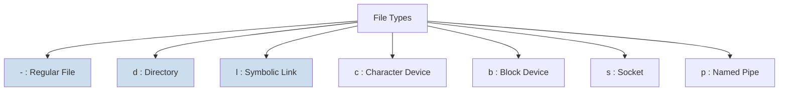

# 2. File Types and Integrity Verification 🕵️

Mawa, Linux lo, "everything is a file" ane oka famous saying undi. Manam normal ga chuse text files, image files matrame kaadu, directories, hardware devices, and network connections ni kuda files laage treat chestundi.

Ee file lo, manam aa different file types ento chuddam and oka file corrupt avvakunda, original gaane unda ani ela verify cheyalo nerchukundam.

---

## Common Linux File Types

`ls -l` command lo, output lo first character file type ni cheptundi.



*   **`-` (Regular File):** The most common type. It can be a text file, an image, a video, or a binary program.
*   **`d` (Directory):** Manam already chusinam, idi vere files and directories ni contain chese oka special file.
*   **`l` (Symbolic Link):** Oka file ki or directory ki unde oka shortcut. Manam deeni gurinchi next file lo detail ga chuddam.
*   **`c` (Character Device):** Data ni character by character stream chese devices. Examples: keyboard (`/dev/tty`), mouse.
*   **`b` (Block Device):** Data ni fixed-size blocks lo read/write chese devices. Examples: Hard drives (`/dev/sda`), USB drives.
*   **`s` (Socket):** Two processes madhyalo network-style connection kosam use chese oka special file.
*   **`p` (Named Pipe):** `mkfifo` command tho create chestaru, idi kuda inter-process communication kosame.

---

## Commands for Identification and Verification

### **`file`** & **`stat`**

Manam ee rendu commands ni `02-folder-structure` module lo chusam, kani ippudu vaati importance inka clear ga ardam avtundi.

*   **`file <filename>`**: File extension ni nammakunda, file lopali content (magic number) ni chusi, adi aey type o cheptundi.
    ```bash
    file /etc/passwd  # Output: ASCII text
    file /bin/bash    # Output: ELF 64-bit LSB pie executable...
    file /dev/sda     # Output: block special
    ```
*   **`stat <filename>`**: File gurinchi anni possible metadata ni istundi, including its type from the `ls -l` perspective.
    ```bash
    stat /etc/passwd | grep "File" # Output: File: /etc/passwd
    stat /etc/       | grep "File" # Output: File: /etc/
    # Notice the trailing slash for the directory
    ```

---

### Verifying File Integrity: `md5sum` & `sha256sum`

Oka pedda software download chesinappudu (like an Ubuntu ISO image), aa file download process lo corrupt avvakunda, original gaane unda ani manam ela check cheyali? Daanike ee checksum commands.

*   **Purpose:** Ee commands oka file ni input ga teeskoni, daani content meeda oka complex mathematical function run chesi, oka unique, fixed-length string ni generate chestayi. Ee string ni **hash** or **checksum** antaru. File lo chinna dot change ayina, ee hash completely maaripotundi.
*   **`md5sum`**: Generates a 128-bit hash value. It's fast but is now considered less secure for cryptography. File integrity check ki parledu.
*   **`sha256sum`**: Generates a more secure and longer 256-bit hash. Idi ippudu standard.

*   **Real-World DevOps Scenario:**
    You download an important binary, `my-app.tar.gz`, from a repository. The website also provides the SHA256 checksum for verification.

    1.  **Website lo unna checksum:**
        `e3b0c44298fc1c149afbf4c8996fb92427ae41e4649b934ca495991b7852b855  my-app.tar.gz`

    2.  **Manam mana local file ki checksum generate cheyali:**
        ```bash
        sha256sum my-app.tar.gz
        ```

    3.  **Compare the output:**
        The output of your command should be **exactly** the same as the one on the website. Okavela veru ga unte, your file is corrupted or has been tampered with.

*   **How to check multiple files:**
    You can save the checksums in a file (e.g., `checksums.txt`) and verify all files at once.
    ```bash
    # Create the checksum file
    sha256sum *.zip > checksums.txt

    # Later, to verify
    sha256sum -c checksums.txt
    ```
*   **Sample Output (`sha256sum -c`):**
    ```text
    file1.zip: OK
    file2.zip: OK
    file3.zip: FAILED
    sha256sum: WARNING: 1 computed checksum did NOT match
    ```

Mawa, file types ni ardam cheskovadam and checksums tho verify cheyadam anedi security and system administration lo chala critical skills. Next, manam Linux lo unna most interesting file types lo okati, symbolic links gurinchi detail ga chuddam.
