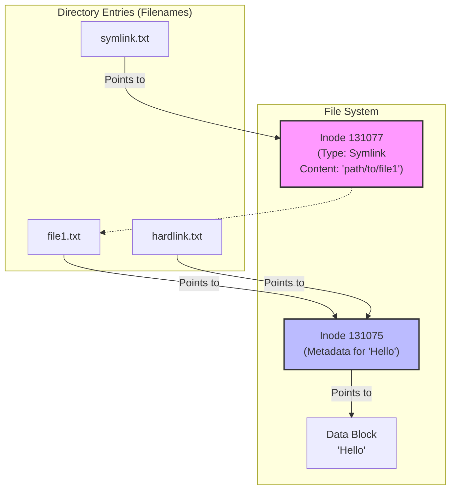

# 3. Links: Hard vs. Symbolic (Soft) Links 🔗

Mawa, Linux lo, manam oka file ki different names ivvochu, or oka file ki shortcuts create cheyochu. Ee concept ni **links** antaru. Evi chala powerful, kani ardam cheskovadaniki konchem tricky ga untayi.

There are two types of links in Linux: **Hard Links** and **Symbolic (or Soft) Links**.

---

## What is an Inode?

Ee links ardam cheskovali ante, mundu manam **inode** ante ento teluskovali. Prathi file and directory ki filesystem lo oka unique ID number untundi, daanne inode number antaru. Ee inode lo file యొక్క metadata (permissions, owner, size, and most importantly, aa file data disk lo ekkada store ayyindo aa pointer) antha store ayyi untundi.

A filename is just a human-readable label that points to an inode.

---

## Hard Links

*   **What it is:** A hard link is a **direct pointer to an inode**. Ante, manam oka file ki inko peru isthunnam anamata. Rendu file names, kani oke inode, oke data on the disk. It's like one person having two official names.
*   **How to create:** `ln <original_file> <new_link_name>`
*   **Key Characteristics:**
    *   All hard links are equal. Original file delete chesina, link untene data safe ga untundi. Anni links delete aithe ne, disk lo unna data space free avtundi.
    *   You **cannot** create a hard link for a directory.
    *   You **cannot** create a hard link across different filesystems (e.g., from your main drive to a USB drive).

*   **Real-World Usage:**
    ```bash
    # Create a file
    echo "This is the original data." > original.txt

    # Create a hard link to it
    ln original.txt hardlink.txt

    # Let's check their inode numbers using ls -i
    ls -i original.txt hardlink.txt
    # Output: 131075 original.txt  131075 hardlink.txt  <-- SAME INODE NUMBER!

    # Now, let's delete the original file
    rm original.txt

    # Is the data still there? Yes!
    cat hardlink.txt
    # Output: This is the original data.
    ```

---

## Symbolic Links (Symlinks or Soft Links)

*   **What it is:** A symbolic link is **not a direct pointer to the inode**. It's a special file that contains the **path** to another file or directory. It's just a shortcut, like a Windows shortcut.
*   **How to create:** `ln -s <original_file_or_directory> <new_link_name>` (The `-s` is for symbolic).
*   **Key Characteristics:**
    *   It's just a pointer. If you delete the original file, the link becomes a "dangling" or "broken" link. It points to nothing.
    *   You **can** create symbolic links for directories. This is very common.
    *   You **can** create symbolic links across different filesystems.

*   **Real-World Usage:**
    ```bash
    # Create a file
    echo "This is some data." > data.txt

    # Create a symbolic link to it
    ln -s data.txt symlink.txt

    # Let's check their inodes and ls -l output
    ls -li data.txt symlink.txt
    # Output:
    # 131076 -rw-r--r-- 1 jules jules 20 Sep  2 19:00 data.txt
    # 131077 lrwxrwxrwx 1 jules jules  8 Sep  2 19:01 symlink.txt -> data.txt <-- DIFFERENT INODES!

    # Now, let's delete the original file
    rm data.txt

    # Try to access the data via the symlink
    cat symlink.txt
    # Output: cat: symlink.txt: No such file or directory  <-- It's broken!
    ```

---

## Visualizing the Difference

Ee Mermaid diagram tho difference inka clear ga ardam avtundi.


Hard links (`file1.txt`, `hardlink.txt`) rendu oke inode ni point chestunnayi. Symbolic link (`symlink.txt`) ki oka separate inode undi, and aa inode lo unna data just inkoka file yokka path matrame.

---

## Summary: Hard vs. Soft

| Feature                      | Hard Link                                  | Symbolic (Soft) Link                       |
| ---------------------------- | ------------------------------------------ | ------------------------------------------ |
| **What it points to**        | The Inode (the actual data)                | The Filename (a path)                      |
| **Can link to directories?** | No                                         | **Yes**                                    |
| **Cross filesystems?**       | No                                         | **Yes**                                    |
| **If original is deleted...**| Link still works, data is safe.            | Link is broken ("dangling").               |
| **Command**                  | `ln target link`                           | `ln -s target link`                        |

Mawa, 99% of the time nuvvu use chesedi **symbolic links**. They are more flexible and intuitive. Next, manam ee files and links ni system lo ela vethakalo nerchukundam.
